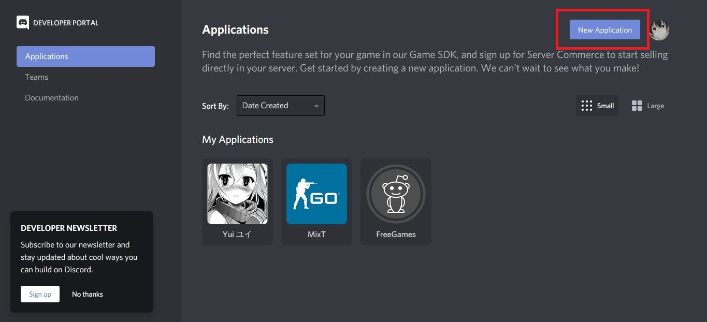
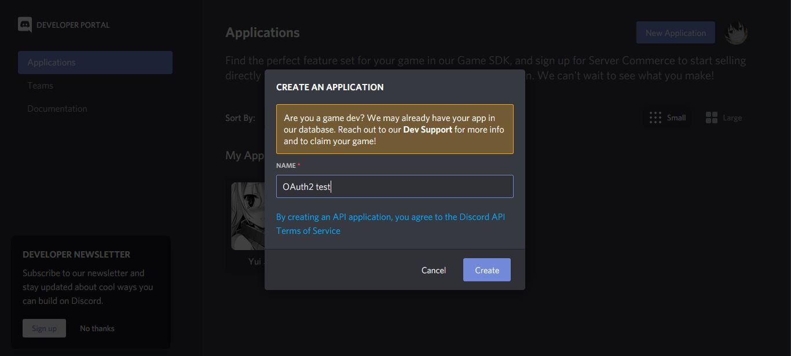
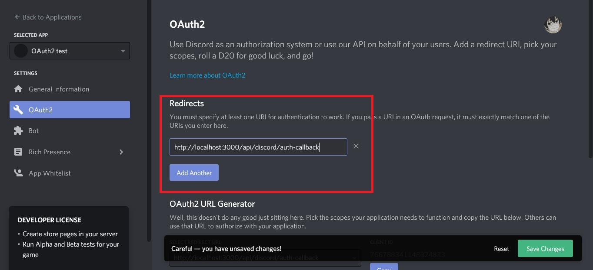
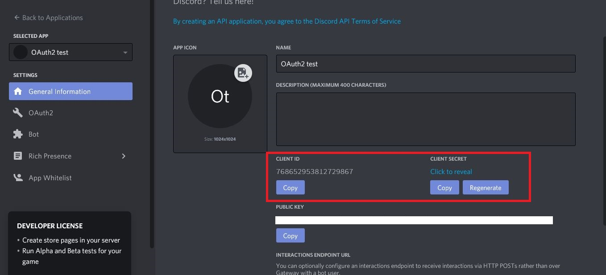
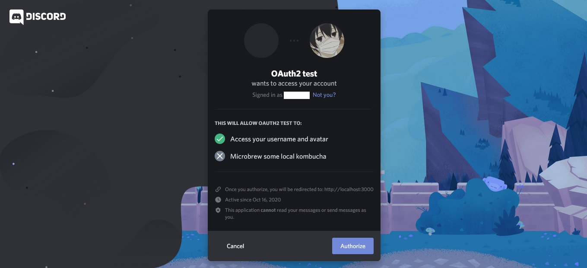
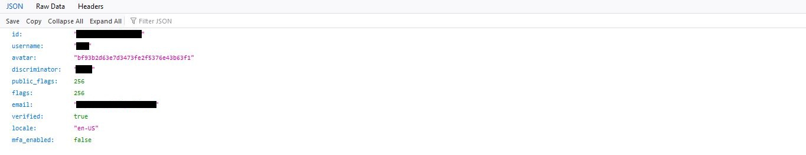

<h1>Discord OAuth2</h1>

Implementation of Discord OAuth2 authentication in Node.js/Typescript to obtain authenticated user information.

<hr>

<h2>Configuration and Installation</h2>

1) Create an [Discord application](https://discord.com/developers/applications) and define a name:





2) Set the redirect URL and save changes:



3) Clone this project to your computer:

```
git clone https://github.com/ArturMiguel/discord-oauth2
```

4) Install the dependencies:

```
npm install
```

5) Create an `.env` file with the <b>CLIENT ID</b> and <b>CLIENT SECRET</b> from your Discord application:

```
CLIENT_ID=
CLIENT_SECRET=
```



<hr>

<h2>Running</h2>

1) To run in development mode, type:

```
npm run dev
```

2) Access `http://localhost:3000/api/discord/auth`



3) Clicking in "Authorize", will return a json with the authenticated user's information:

